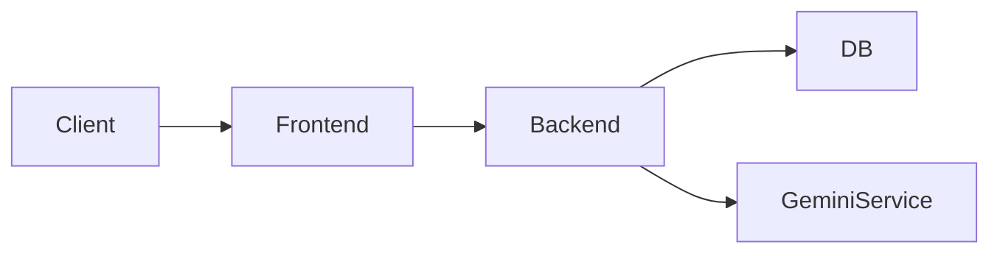

# SmartStoreAi

SmartStoreAi is an e-commerce demo application that integrates AI-powered features for product descriptions, analytics, and inventory alerts.

## Demo Video

Click the thumbnail to view the demo (replace with your uploaded video):

## Screenshots

## Architecture

See the architecture overview in `docs/architecture.md`.

## Database

See `docs/db_schema.sql` for the documented schema.

## Setup (Backend)

1. cd backend
2. npm install
3. Create a `.env` with your MongoDB connection and API keys
4. npm start

## Setup (Frontend)

1. cd frontend
2. npm install
3. npm run dev

## API Endpoints

- `POST /api/auth/login` — login
- `POST /api/auth/signup` — signup
- `GET /api/products` — list products
- `POST /api/ai/generate` — AI-generated content

## Contributing

1. Fork the repo
2. Create a feature branch
3. Make changes and open a PR

## Files of Interest

- Backend controllers: `backend/controllers`
- Frontend components: `frontend/src/components`
- AI service: `backend/services/geminiService.js`

---

Replace the placeholder images and video links in the `docs/` folder with your actual assets.
